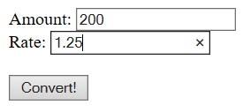
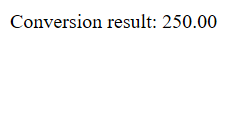
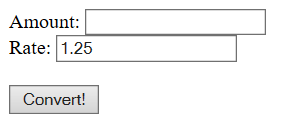

# Simple Java Servlet Currency Converter Example
CSUEB CS-401 Software Development SP2019

### Screenshot

### Assignment Instructions
Your assignment is to implement a simple web service which lets users convert an amount from one currency to another, for example from USD to EUR. The interface should consist of two text fields, “Amount” and “Rate,” and a submit button, “Convert!” If you want to convert an amount from one currency to another, we input the amount in the “Amount” text field and presses the “Convert!” button. The service should reply with a new web page which displays the result of the conversion. The service should remember which exchange rate is being used for conversion, initially 1.0. If the user wants to change the exchange rate he inputs a new rate in the “Rate” text field and the amount to be converted in the “Amount” field. The new rate should be remembered for future conversion when the “Rate” field is left empty. 
1.	Write your servlet in a file named Converter.java. 
2.	You should implement one doGet method and one doPost method. 
3.	In the doGet method, write code which produces an HTML-page. Let the “action” attribute of the <form> tag have the value “/converter/servlet/Converter”, pointing out the servlet you are implementing. Let the “method” attribute have the value “post”. 
4.	In the doPost method, write code which retrieves the values entered into the text fields of the HTML form. Process the information accordingly and produce a suitable HTML page as a reply. 
5.	Use an attribute in the Converter class to store the current exchange rate. 
